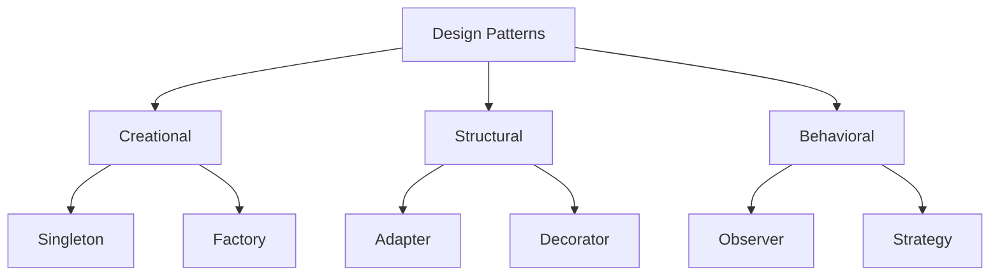
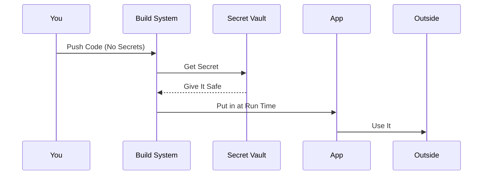
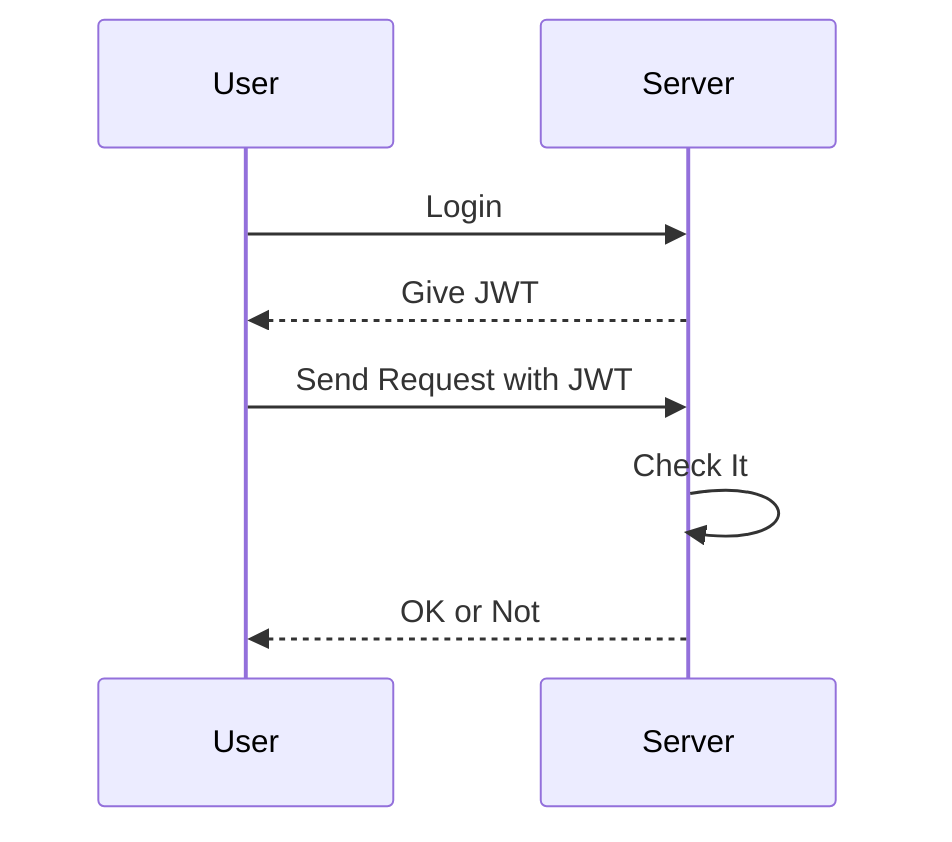
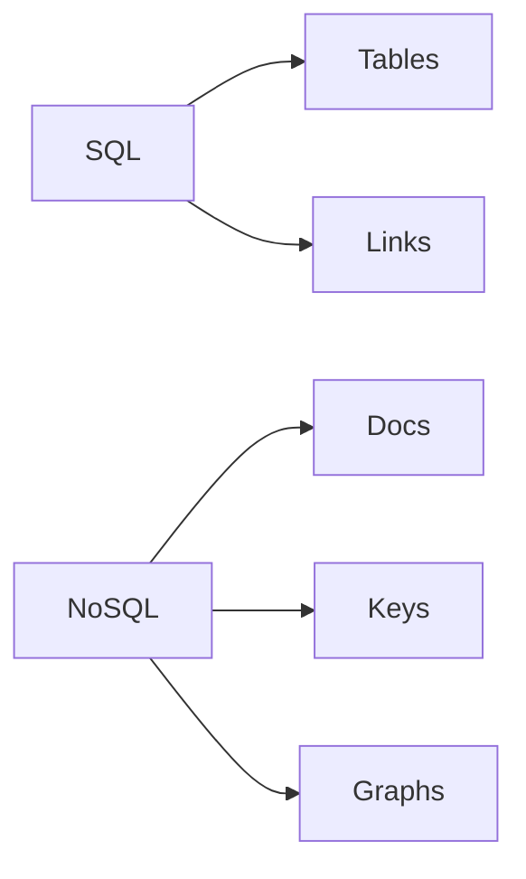
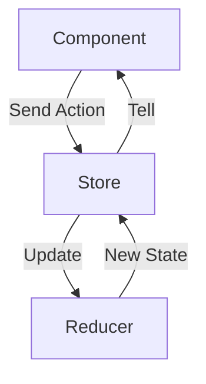

# Written Questionnaire


## 1. What is a Design Pattern and How Can We Use Them in Projects?

### What is a Design Pattern?
Design patterns are like smart shortcuts for solving common problems in coding. They're not actual code you copy-paste, but ideas or plans that experienced coders use over and over. Think of them as recipes for building software that works well.

A famous book by some experts (called the Gang of Four) grouped them into three types:
- **Creational**: About making objects the right way, like Singleton (only one copy of something).
- **Structural**: How to put classes and objects together, like Adapter (making things fit that don't).
- **Behavioral**: How objects talk to each other, like Observer (one thing watches another for changes).

They help make code easier to change, reuse, and understand.

### How to Use Them in Projects
In a real project, you spot a problem, pick a pattern that fits, and tweak it for your needs. Here's how:
1. Find the issue, like needing to add features without messing up old code.
2. Choose a pattern, say Decorator for adding extras.
3. Code it up and test it.
4. Write notes so your team knows.

For example, if you want just one database connection in your app, use Singleton:


It saves time and makes your project stronger.

#### Diagram: Types of Design Patterns


#### Image
Check this pic for all the patterns:  


## 2. How to Store Secrets in an App Without Showing Them Online?

### Explanation
Secrets are things like passwords or API keys that you don't want hackers to see. If you put them right in your code, anyone can find them on GitHub or wherever.

### Ways to Keep Them Safe
1. **Use Environment Variables**: Set them in your computer's settings or server. In code, you grab them like `process.env.MY_SECRET`. Don't commit them to git.
2. **Secret Tools**: Use services like AWS Secrets Manager or HashiCorp Vault. They keep secrets locked up and you pull them when needed.
3. **Encrypted Files**: Put them in a file that's locked with a password, and ignore it in git.
4. **During Deployment**: Add them when you build and push your app, using tools like GitHub Actions.

Always change them often and watch who accesses what.

#### Example in Node.js with AWS
```javascript
const AWS = require('aws-sdk');
const secrets = new AWS.SecretsManager();

async function getMySecret() {
  const data = await secrets.getSecretValue({ SecretId: 'my-key' }).promise();
  return JSON.parse(data.SecretString).key;
}
```

#### Diagram: How Secrets Flow


#### Image
See this for Vault:  


## 3. What is JWT and How Does It Work?

### What is JWT?
JWT means JSON Web Token. It's a way to send info safely between a user and a server, like for logging in. It's a string with three parts: header, payload, and signature, split by dots.

- Header: Says what type and how it's signed.
- Payload: Has the data, like user name or when it expires.
- Signature: Proves it's real, like a lock.

### How It Works
1. User logs in, server makes a JWT and sends it.
2. User saves it and sends it back with requests.
3. Server checks the signature and if it's not old.
4. If good, let them in.

It's fast because the server doesn't store sessions.

#### Pros and Cons
Good: Easy to scale, no big database needed.  
Bad: Hard to cancel once made, so make them short.

#### Example in Node.js
```javascript
const jwt = require('jsonwebtoken');
const secret = 'shhh';

const token = jwt.sign({ user: 'bob' }, secret, { expiresIn: '1h' });

jwt.verify(token, secret, (err, data) => {
  if (err) console.log('Bad');
  else console.log(data.user);  // bob
});
```

#### Diagram: JWT Steps


#### Image
Look at this for the parts:  


## 4. Difference Between SQL and NoSQL Databases?

### Explanation
SQL databases are like organized tables with rules. NoSQL are more free, for big or messy data.

### Main Differences
Here's a table:

| Thing              | SQL                                      | NoSQL                                    |
|--------------------|------------------------------------------|------------------------------------------|
| How Data is Stored| Tables with fixed columns               | Flexible, like docs or key-values        |
| Language          | SQL queries                             | Different for each, like Mongo's own     |
| Rules             | Strict schema, keeps data clean         | Change anytime, no strict rules          |
| Growing           | Add more power to one machine           | Add more machines easily                 |
| Safety            | Strong rules for transactions           | Often looser, but fast                   |
| Best For          | Banks, shops with links between data    | Social apps, lots of changing data       |
| Examples          | MySQL, Postgres                         | MongoDB, Redis                           |

Pick SQL for order, NoSQL for speed and size.

#### Diagram: Data Styles


#### Image
See this comparison:  


## 5. Good State Management for Frontend Apps and Why?

### My Pick: Redux
I suggest Redux for managing state in frontends, like in React apps. It's a box that holds all your app's data in one place, so everything stays in sync.

#### Why?
- It's predictable: Changes happen in a clear way, easy to debug.
- All state together: No passing data around messily.
- Grows well: Handles big apps with extras like async stuff.
- Lots of help: Big community and tools.

Other options like Context API are simpler for small apps, but Redux is great for medium or big ones.

#### How It Works
- Store: The big box of state.
- Actions: Say what to do, like "add item".
- Reducers: Update the state based on actions.

#### Example in React
```javascript
// Action
export const add = () => ({ type: 'ADD' });

// Reducer
const start = { count: 0 };
export const reducer = (state = start, action) => {
  if (action.type === 'ADD') return { ...state, count: state.count + 1 };
  return state;
};

// Store
import { createStore } from 'redux';
export const store = createStore(reducer);

// In App
import { Provider } from 'react-redux';
<Provider store={store}>Your App</Provider>

// Component
import { useSelector, useDispatch } from 'react-redux';
const Counter = () => {
  const count = useSelector(state => state.count);
  const dispatch = useDispatch();
  return (
    <div>
      Count: {count}
      <button onClick={() => dispatch(add())}>Add</button>
    </div>
  );
};
```

#### Diagram: Redux Flow


#### Image
Check this flow:  

